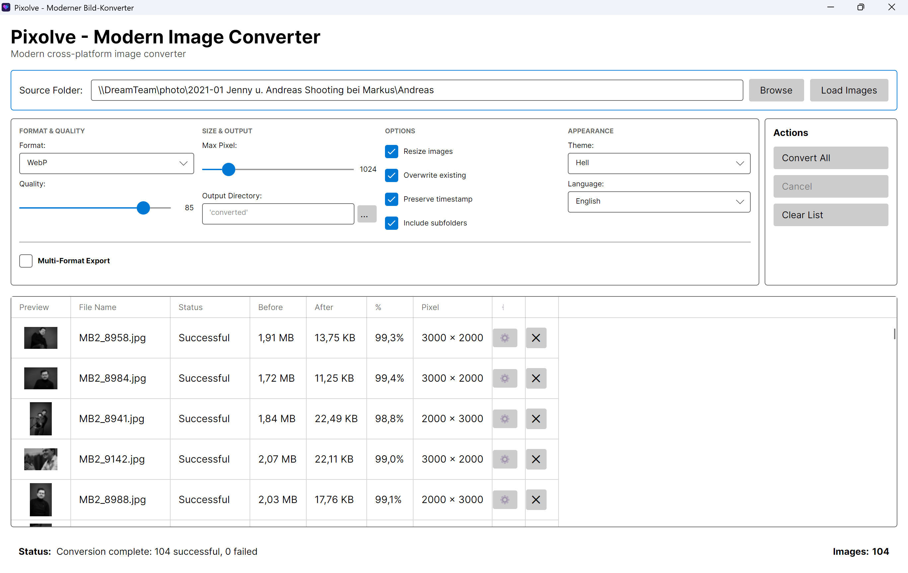
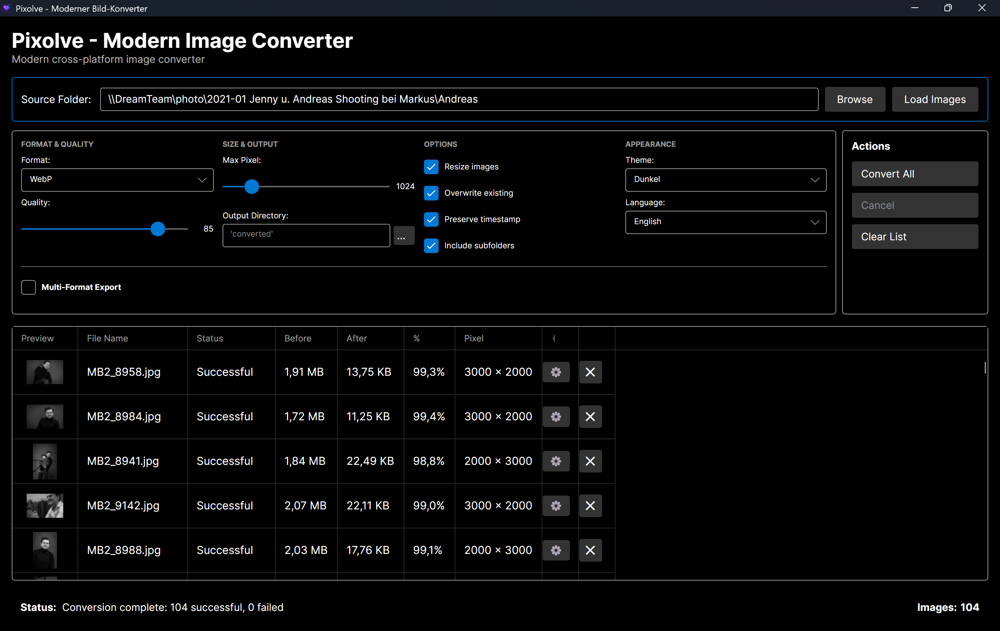
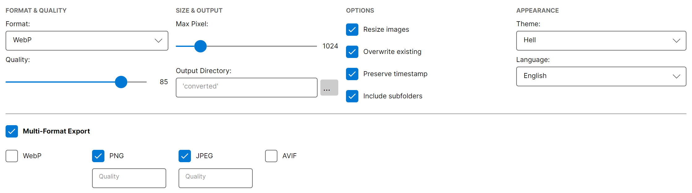
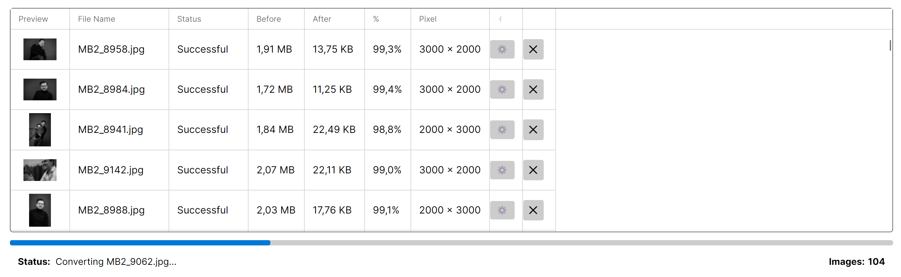
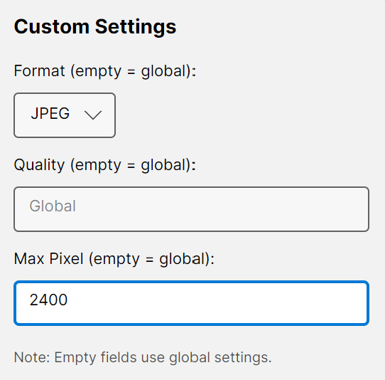

# Pixolve

<div align="center">


**Pixolve** is a modern, cross-platform image conversion tool built with Avalonia UI and .NET 9. Convert your images to modern formats like WebP, AVIF, and more with an intuitive, blazing-fast interface.

[Features](#features) • [Screenshots](#screenshots) • [Installation](#installation) • [Quick Start](#quick-start) • [Building](#building-from-source)

</div>

---

## ✨ Features

### Core Functionality
- 🖼️ **Multi-Format Support**: Convert between WebP, AVIF, PNG, and JPEG formats
- 🔄 **Multi-Format Export**: Export a single image to multiple formats simultaneously
- 🚀 **Batch Processing**: Convert hundreds of images at once with progress tracking
- ⚡ **High Performance**: Powered by SkiaSharp for lightning-fast image processing
- 📁 **Smart Organization**: Auto-creates organized output folders with proper naming

### User Interface
- 🎨 **Modern Fluent Design**: Clean, responsive interface that adapts to your workflow
- 🌓 **Dark Mode**: Full dark/light theme support with system integration
- 🌍 **Multilingual**: English and German language support
- 🎯 **Drag & Drop**: Intuitive file and folder handling
- 👁️ **Live Preview**: Thumbnail previews in the file list
- 📊 **Real-time Statistics**: See file sizes, compression ratios, and progress

### Advanced Features
- ⚙️ **Per-Image Settings**: Customize format, quality, and size for individual images
- 🔧 **Global Settings**: Set default conversion parameters
- 📏 **Smart Resizing**: Automatic image resizing with dimension suffix in filenames
- 💾 **Settings Persistence**: All preferences are saved between sessions
- 📂 **Subfolder Support**: Include subfolders in batch operations
- 🔄 **Quality Presets**: Quick access to common quality settings

### Technical Highlights
- 🌍 **100% Cross-Platform**: Native performance on Windows, macOS, and Linux
- 🏗️ **Clean Architecture**: Separation of concerns with MVVM pattern
- 🧪 **Well-Tested**: Comprehensive test coverage
- 🔒 **Type-Safe**: Built with modern C# 12 and .NET 9

## 📸 Screenshots

### Main Interface (Light Theme)

*Clean, modern interface with all conversion settings at your fingertips*

### Main Interface (Dark Theme)

*Easy on the eyes with full dark mode support*

### Multi-Format Export

*Export one image to multiple formats with individual quality settings*

### Batch Conversion in Progress

*Real-time progress tracking for batch operations*

### Per-Image Custom Settings

*Fine-tune settings for individual images via the gear icon*

## 📦 Installation

### Download Pre-built Binaries

Visit the [Releases](https://github.com/AndreasKalkusinski/Pixolve/releases) page to download the latest version for your platform:

#### Windows
1. Download `Pixolve-vX.X.X-win-x64.zip`
2. Extract the archive
3. Run `Pixolve.Desktop.exe`

#### Linux
1. Download `Pixolve-vX.X.X-linux-x64.zip`
2. Extract the archive
3. Make executable: `chmod +x Pixolve.Desktop`
4. Run: `./Pixolve.Desktop`

#### macOS

**Option 1: DMG Installer (Recommended)**
1. Download `Pixolve-vX.X.X-macOS.dmg`
2. Double-click to mount the disk image
3. Drag `Pixolve.app` to the Applications folder
4. Eject the disk image
5. Launch from Applications (Right-click → Open on first launch)

**Option 2: ZIP Archive**
1. Download `Pixolve-vX.X.X-macOS.zip`
2. Extract the archive
3. Drag `Pixolve.app` to Applications
4. Launch (Right-click → Open on first launch)

> **macOS Security Note**: On first launch, right-click the app and select "Open" to bypass Gatekeeper. Subsequent launches work with double-click.

> **Note**: All binaries are self-contained and include the .NET runtime - no additional dependencies required!

## 🚀 Quick Start

### Basic Conversion
1. **Load Images**:
   - Click "Durchsuchen" (Browse) and select a folder with images
   - Or drag & drop images/folders directly into the window
   - Click "Bilder laden" (Load Images) to scan the folder

2. **Configure Settings**:
   - **Format**: Choose output format (WebP, AVIF, PNG, JPEG)
   - **Quality**: Adjust quality slider (0-100)
   - **Max Pixel**: Set maximum width/height for resizing
   - **Output Directory**: Choose where to save (defaults to "converted" subfolder)

3. **Convert**: Click "Alle konvertieren" (Convert All)

4. **View Results**: Check the status column for conversion results and file size savings

### Advanced Usage

#### Multi-Format Export
1. Enable "Multi-Format Export" checkbox in settings
2. Select which formats you want (WebP, PNG, JPEG, AVIF)
3. Optionally set custom quality for each format
4. Convert - each image will be exported in all selected formats!

#### Per-Image Custom Settings
1. Click the ⚙ (gear) icon next to any image in the list
2. Set custom format, quality, or size for that specific image
3. Leave fields empty to use global settings
4. Convert as usual

#### Theme & Language
- **Theme**: Choose Light, Dark, or System (follows OS theme)
- **Language**: Switch between German and English
- All settings are automatically saved

## Building from Source

### Prerequisites

- [.NET 9 SDK](https://dotnet.microsoft.com/download/dotnet/9.0)
- Git

### Clone and Build

```bash
# Clone the repository
git clone https://github.com/AndreasKalkusinski/Pixolve.git
cd Pixolve

# Restore dependencies and build
dotnet build

# Run the application
dotnet run --project src/Pixolve.Desktop
```

### Run Tests

```bash
dotnet test
```

### Publish Self-Contained Binaries

#### macOS (Automated)
```bash
# Create .app bundle with DMG installer
./publish-macos.sh

# Optional: Create DMG installer separately
./create-dmg.sh
```

This creates:
- `publish/Pixolve.app` - Ready-to-distribute app bundle
- `publish/Pixolve-v1.1.0-macOS.zip` - ZIP archive
- `publish/Pixolve-v1.1.0-macOS.dmg` - DMG installer (if using create-dmg.sh)

#### Windows
```bash
dotnet publish src/Pixolve.Desktop/Pixolve.Desktop.csproj -c Release -r win-x64 --self-contained true -p:PublishSingleFile=true -o ./publish/win-x64
```

#### Linux
```bash
dotnet publish src/Pixolve.Desktop/Pixolve.Desktop.csproj -c Release -r linux-x64 --self-contained true -p:PublishSingleFile=true -o ./publish/linux-x64
```

## 📁 Project Structure

```
Pixolve/
├── src/
│   ├── Pixolve.Desktop/           # Avalonia UI application
│   │   ├── Views/                 # AXAML views
│   │   │   └── MainWindow.axaml   # Main application window
│   │   ├── ViewModels/            # View models (MVVM)
│   │   │   └── MainWindowViewModel.cs
│   │   ├── Converters/            # Value converters for data binding
│   │   ├── Resources/             # Localization strings
│   │   ├── Services/              # UI services (Theme, etc.)
│   │   ├── Assets/                # Images, icons, fonts
│   │   │   └── pixolve-logo.ico   # Application icon
│   │   └── Program.cs             # Entry point
│   └── Pixolve.Core/              # Core business logic
│       ├── Models/                # Data models
│       │   ├── ImageFile.cs       # Image file representation
│       │   ├── ConversionSettings.cs
│       │   ├── UserSettings.cs
│       │   ├── ImageFormat.cs
│       │   ├── AppTheme.cs
│       │   ├── AppLanguage.cs
│       │   └── MultiFormatSettings.cs
│       ├── Services/              # Business services
│       │   ├── ImageConverter.cs  # Core conversion logic
│       │   ├── FolderScanner.cs   # File system operations
│       │   └── SettingsService.cs # Settings persistence
│       └── Interfaces/            # Service contracts
├── tests/
│   └── Pixolve.Tests/             # xUnit tests
├── docs/
│   └── screenshots/               # README screenshots
├── .github/
│   └── workflows/                 # GitHub Actions CI/CD
└── README.md
```

## Architecture

Pixolve follows clean architecture principles:

- **Pixolve.Desktop**: UI layer (Avalonia MVVM)
- **Pixolve.Core**: Business logic layer (platform-independent)
- **Pixolve.Tests**: Test layer (xUnit)

### Key Technologies

- **UI Framework**: [Avalonia UI](https://avaloniaui.net/) 11.3+
- **Image Processing**: [SkiaSharp](https://github.com/mono/SkiaSharp) 2.88+
- **MVVM Framework**: [CommunityToolkit.Mvvm](https://learn.microsoft.com/en-us/dotnet/communitytoolkit/mvvm/)
- **Testing**: xUnit, FluentAssertions

## Contributing

We welcome contributions! Please see [CONTRIBUTING.md](CONTRIBUTING.md) for details.

### Development Setup

1. Fork the repository
2. Create a feature branch: `git checkout -b feature/amazing-feature`
3. Commit your changes: `git commit -m 'Add amazing feature'`
4. Push to the branch: `git push origin feature/amazing-feature`
5. Open a Pull Request

## 🗺️ Roadmap

### ✅ Version 1.0 (Released)
- [x] Project structure setup
- [x] Multi-format conversion (WebP, AVIF, PNG, JPEG)
- [x] Modern Avalonia UI implementation
- [x] Drag & drop support
- [x] Batch processing
- [x] Thumbnail previews
- [x] Per-image custom settings
- [x] Settings persistence
- [x] Smart file naming with dimension suffix
- [x] Cross-platform support (Windows, macOS, Linux)

### ✅ Version 1.1 (Current)
- [x] Dark Mode support
- [x] Multilingual support (English/German)
- [x] Multi-Format Export (one image → multiple formats)
- [x] Improved UI layout and responsiveness
- [x] Enhanced README with comprehensive documentation

### 🚧 Version 1.2 (Planned)
- [ ] Compression statistics and reporting
- [ ] Undo/Redo functionality
- [ ] Image preview (before/after comparison)
- [ ] More language support
- [ ] Performance optimizations

### 🔮 Version 2.0 (Future)
- [ ] HEIF/HEIC support
- [ ] JPEG XL support
- [ ] Watermark support
- [ ] Profile/Template system
- [ ] CLI interface for automation
- [ ] Batch rename functionality
- [ ] Advanced filtering options

## License

This project is licensed under the MIT License - see the [LICENSE](LICENSE) file for details.

## Acknowledgments

- Built with [Avalonia UI](https://avaloniaui.net/)
- Image processing powered by [SkiaSharp](https://github.com/mono/SkiaSharp)
- Inspired by the need for a modern, cross-platform image converter

## 💬 Support

- 🐛 [Report Issues](https://github.com/AndreasKalkusinski/Pixolve/issues)
- 💡 [Feature Requests](https://github.com/AndreasKalkusinski/Pixolve/issues/new?labels=enhancement)
- 📖 [Documentation](https://github.com/AndreasKalkusinski/Pixolve/wiki)
- 💬 [Discussions](https://github.com/AndreasKalkusinski/Pixolve/discussions)

## 🙏 Acknowledgments

- Built with [Avalonia UI](https://avaloniaui.net/) - Cross-platform XAML framework
- Image processing powered by [SkiaSharp](https://github.com/mono/SkiaSharp) - High-performance 2D graphics
- MVVM framework: [CommunityToolkit.Mvvm](https://learn.microsoft.com/en-us/dotnet/communitytoolkit/mvvm/)
- Inspired by the need for a modern, cross-platform image converter

## 📄 License

This project is licensed under the MIT License - see the [LICENSE](LICENSE) file for details.

## 👨‍💻 Author

Created by **Andreas Kalkusinski** with assistance from Claude Code

---

<div align="center">

**⭐ Star this repository if you find it helpful!**

Made with ❤️ and .NET 9

</div>
